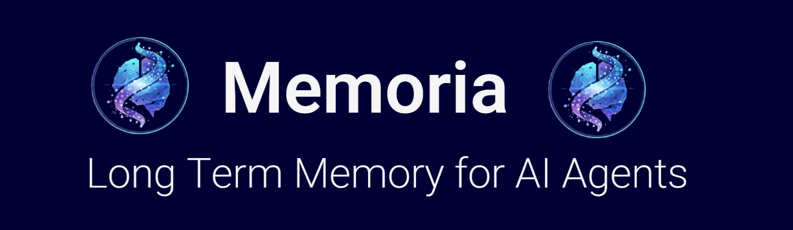

[](https://discord.gg/cSzVWf29bK)


Memoria is a **long-term memory layer for AI agents**.

It enables agents to store, retrieve, and reusev knowledge across interactions. Not just raw facts, but **decisions, methods, preferences, and contextual relationships**. This allows agents to improve over time instead of starting from scratch on every prompt.

Unlike traditional RAG systems that rely purely on embeddings, Memoria combines:
- **Vector search** for semantic recall  
- **Graph-structured memory** for relationships, provenance, and context  
- **Agent-aware write-back** so outcomes and reasoning artifacts compound over time  

Memoria is designed to be:
- **Agent-native**. Built for multi-step reasoning, not just document lookup  
- **Human-controllable**. Inspect, edit, and prune memory  
- **Open-source first**

> ⚠️ Memoria is under active development. An MVP is expected in approximately 2 to 3 weeks.

---

## Roadmap

Memoria is being built in public. This is a **high-level roadmap** and will evolve as the MVP stabilizes.

### Near-term (MVP)
- Core memory write and recall pipeline
- Hybrid vector and graph retrieval
- Basic agent integration API
- Memory schemas for requests, answers, actions, and preferences

### In Progress
- Minimal pruning and update logic

### Planned
- Smarter pruning and forgetting strategies
- Temporal weighting and decay
- Multi-agent shared memory
- Improved developer tooling
- Production-ready backend deployment

**Discussion and updates**
- GitHub Issues (coming soon)  
- **[[Discord Link](https://discord.gg/cSzVWf29bK)]**

---

## How to Deploy

### Current Status
- Backend deployment is not yet available. MVP in progress
- Toy or demo frontend can be deployed locally
- Production usage is not recommended yet

### Frontend (Toy or Demo)

The frontend is a lightweight UI intended for **early experimentation and visualization**, not full system functionality.

```bash
# clone the repo
git clone https://github.com/<your-org>/memoria.git
cd memoria/frontend

# install dependencies
npm install
```

# Contributing
Once the MVP is complete and stablized we will begin opening up for contributions.


# Folder Descriptions

⚠️ Please make sure you update .env.example whenever you add a new environment variable. Also, update requirements.txt when you add a new python package.

## `frontend/`
Contains the source code for the client-side application in react. if you want to run, cd into the folder and run `npm install` followed by `npm run dev`.

## `backend/`
All the code, data and models for backend. This folder is sub-divided into following folders:
  - `src/`: all the api routes, business logic and database interactions are implemented here.
  - `milvus/`: Contains the collection schemas for vector db Milvus. Also contains scripts to fill the collection with data.
  - `neo4j/`: Contains schema for graph db, script to fill the database and fetech details needed for milvus collection.
  - `documents/`: Dummy data for development and testing.
  - `main.py`: The entry point for the FastAPI application to access all the backend services.
  - `requirements.txt`: Lists the Python dependencies required to run the backend application.
  - `README.md`: Documentation specific to the backend folder, providing instructions on setup, usage, and other relevant information.
