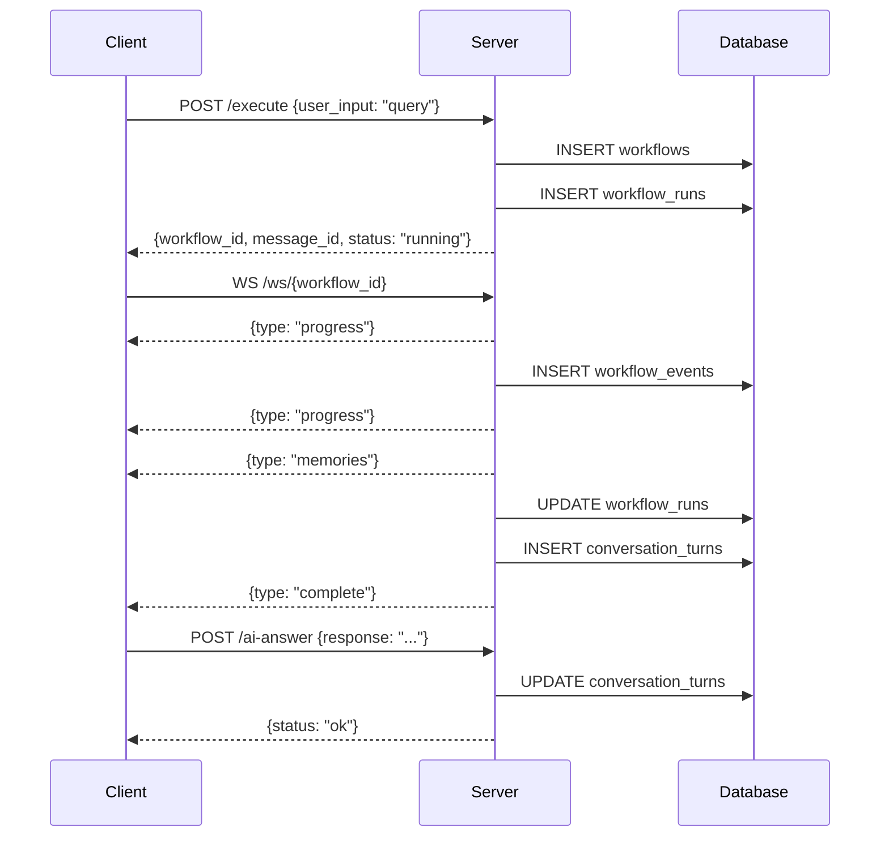
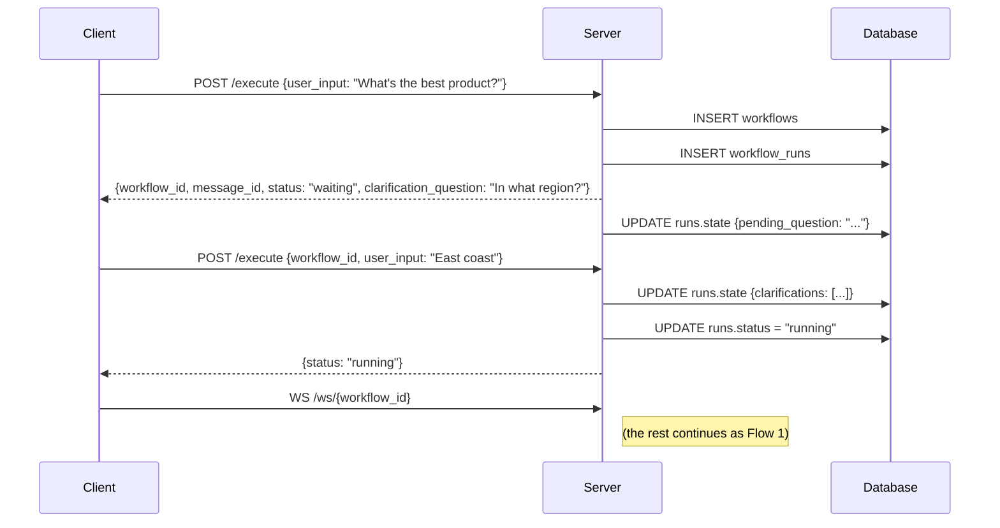
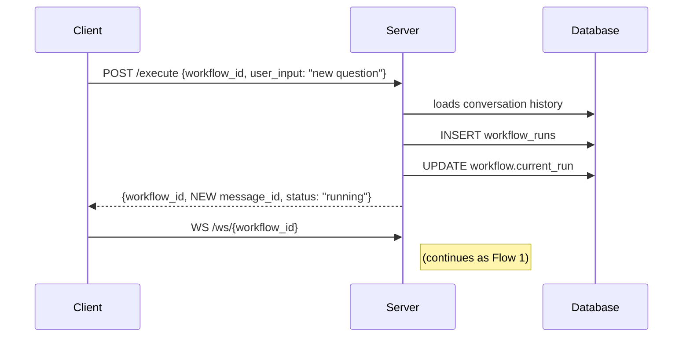

# Memoria API Documentation

The API to communicate with the Memoria backend.

**Base URL:** `http://localhost:8000`  
**API Version:** 0.1.0

## Table of Contents

- [Quick Start](#quick-start)
- [Execute Workflow Endpoint](#execute-workflow)
- [WebSocket Stream Endpoint](#websocket-stream)
- [AI Answer Endpoint](#ai-answer)
- [Workflow Flows](#workflow-flows)
- [Status Codes](#status-codes)

## Workflow Endpoints

### Execute Workflow

**Endpoint:** `POST /workflow/execute`

**Description:**  
Starts a new conversation or continues an existing one. This endpoint handles:
- First message in new conversations (omit `workflow_id`)
- New messages in existing conversations (include `workflow_id`)
- Clarification answers (include `workflow_id`, system detects paused state)

**Request Body:**
```json
{
  "user_input": "string (required)",
  "workflow_id": "uuid4-string (optional - omit for new conversation)",
  "ask_clarifications": true,
  "preferences": {}
}
```

| Field | Type | Required | Description |
|-------|------|----------|-------------|
| `user_input` | string | Yes | The user's message or clarification answer |
| `workflow_id` | string | No | Omit for new conversation, include for existing |
| `ask_clarifications` | boolean | No | Whether to allow clarifying questions (default: true) |
| `preferences` | object | No | Client preferences (model names, tone, etc.) |

**Response:**
```json
{
  "workflow_id": "uuid4-string",
  "message_id": "uuid4-string",
  "status": "running | waiting_for_input | completed | failed",
  "clarification_question": "string or null",
  "message": "string"
}
```

| Field | Description |
|-------|-------------|
| `workflow_id` | Use this for all subsequent requests in this conversation |
| `message_id` | Identifies this specific message/turn |
| `status` | `running` = processing, `waiting_for_input` = needs clarification |
| `clarification_question` | If present, answer this question in next request |

### WebSocket Stream

**Endpoint:** `WS /workflow/ws/{workflow_id}`

Client can connect to this WebSocket to receive real-time updates on the workflow's progress, including  the final memories once ready.

> If client just wants the final memories without progress updates, they can set the query parameter `?final_only=true` or send command `{"command": "get_final"}` anytime.<br>Note: final memories are only sent once the workflow completes.

**Query Parameters:**

| Parameter | Type | Default | Description |
|-----------|------|---------|-------------|
| `cursor` | int | null | Event ID to resume from (omit for all events) |
| `final_only` | bool | false | If true, skip progress events, just send final memories |

**NOTE** - **Cursor is optional**: Omit cursor to get all events from the start. Use cursor for reconnection scenarios.

**Connection Examples:**
```javascript
// Full streaming (all progress events)
const ws = new WebSocket(`ws://localhost:8000/workflow/ws/${workflow_id}`);

// Just get final memories (skip progress)
const ws = new WebSocket(`ws://localhost:8000/workflow/ws/${workflow_id}?final_only=true`);

// Resume from cursor (for reconnection)
const ws = new WebSocket(`ws://localhost:8000/workflow/ws/${workflow_id}?cursor=42`);
```

**Server → Client Events:**
```json
// Progress update
{"type": "progress", "message": "Generating subqueries...", "timestamp": "..."}

// Final memories (the main output)
{
  "type": "memories",
  "message": "Memories retrieved",
  "data": {
    "memories": [{"id": "...", "content": "...", ...}],
    "reasoningbank_hits": [{"key_lesson": "...", ...}]
  }
}

// Error
{"type": "error", "message": "Failed to retrieve memories", "data": {"code": "RETRIEVAL_ERROR"}}

// Workflow complete
{"type": "complete", "message": "Workflow finished"}
```

**Client → Server Commands:**
```json
// Skip to final answer (stop streaming, just give me memories)
{"command": "get_final"}

// Cancel workflow
{"command": "cancel"}
```

### AI Answer

**Endpoint:** `POST /workflow/ai-answer`

**Description:**  
Client is expected to send the AI's final answer that was shown to the user. This is used to fill the conversation history for future context.

**Request Body:**
```json
{
  "workflow_id": "uuid4-string",
  "message_id": "uuid4-string",
  "response": "string",
  "reasoning": "string (optional)",
  "tool_calls": "string (optional)"
}
```

| Field | Type | Required | Description |
|-------|------|----------|-------------|
| `workflow_id` | string | Yes | The workflow identifier for the conversation |
| `message_id` | string | Yes | The message_id from execute response (AI response belongs to this message) |
| `response` | string | Yes | AI's final response to the user |
| `reasoning` | string | No | AI reasoning tokens (if any) |
| `tool_calls` | string | No | Information regarding AI tool calls (if any) |

**Response:**
```json
{
  "status": "ok",
  "message": "AI answer recorded"
}
```

## Workflow Flows

> To view the mermaid diagrams, on vs code install: `Markdown Preview Mermaid Support` extension by Matt Bierner (has around 3.9M downloads as of Jan 2026). If not, view the md file in Github since it supports mermaid diagrams natively in markdown files.

### Flow 1: Simple (No Clarifications)




### Flow 2: With Clarification



### Flow 3: Continuing Existing Conversation (New Turn)



## How the Backend Determines Scenarios

When `POST /execute` is called, the backend determines the following scenario:


- If `workflow_id` is omitted, system determines a _new conversation_ and creates a new workflow and run.
- If `workflow_id` is present AND the `current_run.status` for that id is `waiting_for_input` then it's a _clarification answer_ scenario. The system updates the run state with the clarification and resumes workflow from where it left off.
- If `workflow_id` is present AND the `current_run.status` is `completed` then it's a _new turn_ scenario. The system creates a new run under the existing workflow.
- If `workflow_id` is present AND the `current_run.status` is `running` then the system returns an error indicating the workflow is busy. 
> For the last scenario, Later we will add a advanced interception mechanism similar to Google Antigravity where users can influence ongoing workflows, but for now we keep it simple.

## Status Codes

| Code | Meaning |
|------|---------|
| 200 | Success |
| 201 | Workflow created |
| 400 | Invalid request parameters |
| 404 | Workflow not found |
| 409 | Workflow already busy |
| 500 | Server error |

## Notes

- **final_only mode**: Use `?final_only=true` for simple integrations that just need the memories.
- **Workflow IDs are UUIDs**: Use the exact string returned, don't modify it.
- **message_id tracks a turn**: Use the same message_id when calling `/ai-answer`.

---

**Last Updated:** January 31, 2026