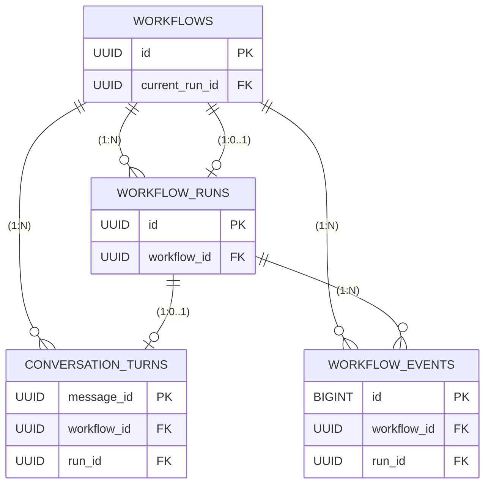

# Agent State DB (PostgreSQL)

This document explains how the agent's workflow state is managed in PostgreSQL. It covers the schema design, table roles, and detailed database interactions for each API scenario.


## Table of Contents

- [Core Concepts](#core-concepts)
- [Schema Overview](#schema-overview)
- [Table Details](#table-details)
- [API Scenarios & Database Interactions](#api-scenarios--database-interactions)
- [Building LLM Prompts from History](#building-llm-prompts-from-history)
- [WebSocket & Cursor Logic](#websocket--cursor-logic)
- [Maintenance & Cleanup](#maintenance--cleanup)


## Core Concepts

### What is a "Turn"?

A **turn** is one complete round of interaction inside a conversation. It has 3 components:

```
┌─────────────────────────────────────────────────────────────┐
│                     ONE CONVERSATION TURN                   │
├─────────────────────────────────────────────────────────────┤
│ 1. USER INPUT          │ "What were last month's sales?"    │
│    + Clarifications    │ Q: "Which region?" A: "Southeast"  │
├─────────────────────────────────────────────────────────────┤
│ 2. OUR MEMORIES        │ [JSON objects sent to AI agent]    │
│    + Reasoning Bank    │ [Relevant reasoning entries ]      │
├─────────────────────────────────────────────────────────────┤
│ 3. AI RESPONSE         │ "Based on the data, sales were..." │
│    + Reasoning + tools │ "web_search(query='2024 sales...')"│
└─────────────────────────────────────────────────────────────┘
```

### Key Distinction: Run vs Turn

| **WorkflowRun** | **ConversationTurn** |
|-----------------|---------------------|
| Exists DURING processing of user message | Exists AFTER a turn is complete |
| Mutable (tracks state) | Immutable (history source) |
| Has clarification state | Has final clarification_history |
| Created at `/execute` | Created when `/ai-answer` received |


## Schema Overview

```
┌─────────────────────────────────────────────────────────────────┐
│                         workflows                               │
│  One row per conversation. Contains metadata + context summary. │
│  current_run_id is pointer to active WorkflowRun (if any)       │
└───────────────────────────┬─────────────────────────────────────┘
                            │ 1:N
        ┌───────────────────┼───────────────────┐
        │                   │                   │
        ▼                   ▼                   ▼
┌───────────────┐   ┌───────────────┐   ┌───────────────┐
│ workflow_runs │   │ conversation_ │   │ workflow_     │
│               │   │ turns         │   │ events        │
└───────────────┘   └───────────────┘   └───────────────┘
```

## Table Details

### 1. `workflows` - Conversation Container

**Purpose**: One row per conversation. Stores conversation-level data.

| Column | Type | Purpose |
|--------|------|---------|
| `id` | UUID | Primary key, returned to client as `workflow_id`. Primary key, Auto-generated |
| `status` | ENUM | `active`, `archived`, `error`. Uses enum type with default active and not nullable. |
| `summary` | TEXT | Rolling summary to prevent context bloat. Uses text type, nullable. |
| `preferences` | JSONB | Client preferences for this conversation. default empty dict and not nullable. |
| `current_run_id` | UUID | Points to active run (null if no run in progress). Uses UUID foreign key with `use_alter` for circular dependency. |
| `error` | JSONB | Error details if status = error. Mutable JSONB dict, nullable. |
| `created_at` | DATETIME | When conversation was created. Uses datetime with UTC now default and not nullable. |
| `updated_at` | DATETIME | Auto-updated on any change to the row. |

**Relationships**:
| Name | Target | Purpose |
|--------------|--------|---------|
| `runs` | `list[WorkflowRun]` | All runs in this conversation. Cascade delete: deleting workflow deletes all its runs. Back-populates with cascade delete on orphans, passive deletes, and explicit foreign keys. |
| `turns` | `list[ConversationTurn]` | All completed turns. Cascade delete enabled. Back-populates with cascade delete on orphans and passive deletes. |
| `events` | `list[WorkflowEvent]` | All streaming events. Cascade delete enabled. Back-populates with cascade delete on orphans and passive deletes. |

**Note on `current_run_id`**: Uses `use_alter=True` because there's a circular FK dependency (workflows → workflow_runs → workflows). SQLAlchemy handles this by creating the FK constraint via ALTER TABLE _after_ table creation. Good practice and avoids crashes.

**When created**: First call to `/execute` without `workflow_id`  
**When deleted**: Manual cleanup jobs  
**Indexes**: `ix_workflows_status` on `status`, `ix_workflows_updated_at` on `updated_at`

---

### 2. `workflow_runs` - Execution State Machine

**Purpose**: Tracks the lifecycle of processing ONE user message. Handles clarification pauses (human-in-the-loop).

| Column | Type | Purpose |
|--------|------|----------------------|
| `id` | UUID | Primary key, UUID, auto-generated |
| `workflow_id` | UUID | Parent conversation (CASCADE: deleting workflow deletes runs). not nullable. |
| `message_id` | UUID | Client-facing message ID (becomes ConversationTurn PK). not nullable and auto-generated. |
| `status` | ENUM | `running`, `waiting_for_input`, `completed`, `failed`, `cancelled`. default=running and not nullable. |
| `user_input` | TEXT | Original user message that started this run. not nullable. |
| `ask_clarifications` | BOOL | Whether SubqueryGenerator should ask clarifying questions. Uses boolean with default true and not nullable. |
| `state` | JSONB | **Checkpoint data** - stores pending_question, clarifications, intermediate results. Helps with resuming workflows. default empty dict and not nullable. |
| `final_output` | JSONB | Final memories when run completes. nullable. |
| `error` | JSONB | Error details if status = failed. nullable. |
| `created_at` | DATETIME | When run was created. Uses datetime with UTC now default and not nullable. |
| `updated_at` | DATETIME | Auto-updated on any change. |

**Relationships**:
| Relationship | Target | Purpose |
|--------------|--------|---------|
| `workflow` | `Workflow` | Parent conversation. Back-populates with Workflow table |
| `turn` | `ConversationTurn` | The completed user interaction turn. Back-populates with uselist=False to enforce single object. |
| `events` | `list[WorkflowEvent]` | Events emitted during this run's execution. Back-populates. |

**The `state` JSONB column**:
```json
{
  "pending_question": "Which region?",        // Set when waiting_for_input
  "clarifications": [                          // Accumulated Q&A
    {"question": "Which region?", "answer": "Southeast"}
  ],
  "subqueries": ["sales Q4 2025", "regional breakdown"],  // Intermediate
  "reasoningbank_hits": [...]                  // Intermediate
}
```

**When created**: Every call to `/execute` that starts processing  
**When deleted**: Can archive old runs.  
**Indexes**: 
  - `ix_workflow_runs_workflow_created` on `(workflow_id, created_at)`
  - `ix_workflow_runs_status` on `(workflow_id, status)`

---

### 3. `conversation_turns` - The Source of Truth

**Purpose**: Permanent, immutable record of completed interactions. Used to build LLM prompts/summaries.

| Column | Type | Purpose |
|--------|------|----------------------|
| `message_id` | UUID | Primary key, same value as `WorkflowRun.message_id` for continuity. auto-generated |
| `workflow_id` | UUID | Parent conversation. not nullable. |
| `run_id` | UUID | Link to the run that created this turn (1:1 enforced via `unique=True`). not nullable. |
| `user_input` | TEXT | The original user query that started this turn. not nullable. |
| `clarification_history` | JSONB | `[{question, answer}, ...]` - all clarification exchanges. nullable. |
| `subqueries` | JSONB | Decomposed subqueries from SubqueryGenerator. nullable. |
| `reasoningbank_hits` | JSONB | Reasoning patterns retrieved from Milvus. nullable. |
| `retrieved_memories` | JSONB | memory objects sent to AI agent. nullable. |
| `ai_answer` | TEXT | AI's final response to the human user. nullable. |
| `ai_reasoning` | TEXT | AI reasoning text. nullable. |
| `ai_tool_calls` | TEXT | History of AI tool calls/actions. nullable. |
| `created_at` | DATETIME | When turn was created. Uses datetime with UTC now default and not nullable. |
| `updated_at` | DATETIME | When AI answer was added. Uses datetime with UTC now default and onupdate. |

**Relationships**:
| Relationship | Target | Purpose |
|--------------|--------|---------|
| `workflow` | `Workflow` | Parent conversation. Back-populates. |
| `run` | `WorkflowRun` | The run that produced this turn (1:1). Back-populates. |

**Note on `run_id` uniqueness**: The `unique=True` constraint ensures each WorkflowRun produces at most one ConversationTurn. Combined with `uselist=False` on WorkflowRun.turn, this creates a strict 1:1 relationship.

**When created**: After workflow completes AND `/ai-answer` is recieved.  
**When deleted**: Manually.  
**Indexes**: `ix_conversation_turns_workflow_created` on `(workflow_id, created_at)` for chronological retrieval

---

### 4. `workflow_events` - WebSocket Stream

**Purpose**: Append-only log for real-time streaming. Temporary entries only for WebSocket streaming, can be deleted immediately after workflow completes (if desired).

| Column | Type | Purpose |
|--------|------|----------------------|
| `id` | BIGINT | Auto-incrementing cursor for streaming. Uses big integer with auto-increment and primary key. |
| `workflow_id` | UUID | Which conversation this event belongs to. not nullable. |
| `run_id` | UUID | Optional link to specific run (for debugging). nullable. |
| `payload` | JSONB | Event data: `{type, message, data}`. not nullable. |
| `is_final` | BOOL | True for completion event containing final memories. Uses boolean with default false and not nullable. |
| `is_error` | BOOL | True if this event represents an error. Uses boolean with default false and not nullable. |
| `created_at` | DATETIME | When event was emitted. Uses datetime with UTC now default and not nullable. |

**Relationships**:
| Relationship | Target | Purpose |
|--------------|--------|---------|
| `workflow` | `Workflow` | Parent conversation. Back-populates. |
| `run` | `WorkflowRun` | Optional link to the run (nullable). Back-populates. |

**Event payload format**:
```json
{
  "type": "progress",
  "message": "Generating subqueries...",
  "data": {}
}
```

**When created**: During workflow execution  
**When deleted**: we can when run completes. its only temporary streaming data.  
**Indexes**: 
- `ix_workflow_events_cursor` on `(workflow_id, id)` for cursor-based polling
- `ix_workflow_events_final` on `(workflow_id, is_final)` with `postgresql_where="is_final = true"` - partial index for O(1) final event lookup

## Relationship Summary Diagram
||--o{ : One to Many (1:N) <br>
||--o| : One to Zero or One (1:0..1) <br>
||     : means mandatory (i.e. Workflow_RUNS can not exist without Workflow) <br> 




## API Scenarios & Database Interactions

**Legend (color-coded quick scan)**
- 🟦 **Table**: workflows
- 🟩 **Table**: workflow_runs
- 🟨 **Table**: conversation_turns
- 🟪 **Table**: workflow_events
- **Action**: Create / Update / Read
- **Values**: key fields touched

### Scenario 1: New Conversation (with Clarification)

**Request**: `POST /execute` with no `workflow_id`

1) 🟦 **Create** workflows — **Values**: `id`, `status=active`, `preferences`  
  Meaning: Start a new conversation container.

2) 🟩 **Create** workflow_runs — **Values**: `workflow_id`, `message_id`, `status=running`, `user_input`, `ask_clarifications`, `state={}`  
  Meaning: Start processing this message.

3) 🟦 **Update** workflows — **Values**: `current_run_id = run_id`  
  Meaning: Mark this run as the active one.

4) **SubqueryGenerator runs** with prompt built from:
   - Current `user_input` from request
   - Empty conversation history (this is first turn)
   - `ask_clarifications=true` flag from request
   - Result: Detects ambiguity, generates clarification question.

5) 🟩 **Update** workflow_runs — **Values**: `status=waiting_for_input`, `state.pending_question="Which region?"`  
   Meaning: Pause workflow, save the clarification question.

6) **Return** to client: `status=waiting_for_input`, `clarification_question="Which region?"`.

### Scenario 2: Clarification Answer (resume same run)

**Request**: `POST /execute` with `workflow_id` (and `current_run.status = waiting_for_input`)

1) 🟦 **Read** workflows — **Values**: `current_run_id`  
   Meaning: Find the active run for this conversation.

2) 🟩 **Read** workflow_runs — **Values**: `status`  
   Meaning: Confirm `status=waiting_for_input` (this is clarification answer, not new turn).

3) 🟩 **Update** workflow_runs — **Values**: `status=running`, append `state.clarifications += {question, answer}`  
   Meaning: Resume execution, save the Q&A pair.

4) **SubqueryGenerator resumes** with prompt built from:
   - Original `user_input` from run
   - Clarification Q&A from `state.clarifications`
   - Empty conversation history (still first turn)
   - Result: Generates subqueries, no more clarifications needed.

5) 🟩 **Update** workflow_runs — **Values**: `state.subqueries=[...]`  
   Meaning: Save generated subqueries for later reference.

6) 🟪 **Create** workflow_events — **Values**: `payload={type:"progress", message:"Generating subqueries..."}`  
   Meaning: Stream progress to WebSocket clients.

7) **ReasoningBank Retriever runs** (parallel with memory retrieval).

8) 🟩 **Update** workflow_runs — **Values**: `state.reasoningbank_hits=[...]`  
   Meaning: Save reasoning patterns for later reference.

9) 🟪 **Create** workflow_events — **Values**: `payload={type:"progress", message:"Retrieving memories..."}`  
   Meaning: Stream progress update.

10) **Memory Retrieval executes** using the subqueries.

11) Continue to Scenario 3 (workflow completion).

### Scenario 3: Workflow Completion (memories ready)

**When**: Memory retrieval finishes (before AI answer)

1) **Memory retrieval completes**, returns list of memory objects.

2) 🟩 **Update** workflow_runs — **Values**: `status=completed`, `final_output={memories, reasoningbank_hits}`  
   Meaning: Run finished; output is ready.

3) 🟨 **Create** conversation_turns — **Values**: `message_id`, `workflow_id`, `run_id`, `user_input`, `clarification_history`, `subqueries`, `reasoningbank_hits`, `retrieved_memories`  
   Meaning: Write the durable history record (AI answer still empty, added later via /ai-answer).

4) 🟪 **Create** workflow_events — **Values**: `payload={type:"memories", data:{memories:[...], reasoningbank_hits:[...]}}`, `is_final=true`  
   Meaning: Send final memories to WebSocket clients.

5) 🟦 **Update** workflows — **Values**: `current_run_id=NULL`  
   Meaning: Clear active run pointer; conversation ready for next turn.

### Scenario 4: AI Answer Received

**Request**: `POST /ai-answer`

1) 🟨 **Update** conversation_turns — **Values**: `ai_answer`, `ai_reasoning`, `ai_tool_calls`, `updated_at`  
  Meaning: Complete the turn with AI response.

### Scenario 5: New Turn in Existing Conversation

**Request**: `POST /execute` with `workflow_id` (and `current_run_id` is null or completed)

1) 🟦 **Read** workflows — **Values**: `current_run_id`, `summary`, `preferences`  
   Meaning: Confirm no active run (new turn, not clarification) and load long-term context.

2) 🟨 **Read** conversation_turns — **Values**: recent 5 turns ordered by `created_at DESC`  
   Meaning: Load short-term conversation history (indexed query, fast).

3) 🟩 **Create** workflow_runs — **Values**: `workflow_id`, `message_id`, `status=running`, `user_input`, `ask_clarifications`, `state={}`  
   Meaning: Start a new run for this new user message.

4) 🟦 **Update** workflows — **Values**: `current_run_id = new_run_id`  
   Meaning: Mark new run as active.

5) **Build SubqueryGenerator prompt** from DB data:
   - **Summary**: 🟦 `workflows.summary` (if present, for long conversations)
   - **Recent history**: 🟨 `conversation_turns` (last 5 turns with user_input, clarifications, memories, ai_answer)
   - **Current input**: `user_input` from request
   - **Preferences**: 🟦 `workflows.preferences`
   - Result: Full conversation context for SubqueryGenerator.

6) **SubqueryGenerator runs** with full conversation history:
   - Analyzes current question in context of past turns
   - May ask clarification if needed (go to waiting_for_input)
   - Or generates subqueries directly

7) 🟩 **Update** workflow_runs — **Values**: `state.subqueries=[...]` (or `status=waiting_for_input` if clarification)
   Meaning: Save subqueries or pause for clarification.

8) **If no clarification needed**: Continue with ReasoningBank + Memory Retrieval (same as Scenario 2 steps 7-11).

## How to Differentiate: Clarification vs New Turn

Both scenarios send `POST /execute` with a `workflow_id`. Here's how we tell them apart:

```python
def determine_scenario(workflow_id: str, user_input: str):
    # 1. Get workflow and its current run
    workflow = db.query(Workflow).filter_by(id=workflow_id).first()
    
    if not workflow:
        raise NotFoundError("Workflow not found")
    
    # 2. Check if there's an active run
    if workflow.current_run_id:
        current_run = db.query(WorkflowRun).filter_by(id=workflow.current_run_id).first()
        
        if current_run.status == RunStatus.waiting_for_input:
            # CLARIFICATION ANSWER - resume the paused run
            return "clarification", current_run
        
        elif current_run.status == RunStatus.running:
            # ERROR - workflow is busy
            raise ConflictError("Workflow is already processing")
    
    # 3. No active run OR current run is completed → NEW TURN
    return "new_turn", None
```

## Building LLM Prompts from History

The `conversation_turns` table is designed for easy prompt construction:

```python
def build_conversation_history(workflow_id: str, max_turns: int = 5) -> str:
    """Build conversation history string for SubqueryGenerator prompt."""
    
    # 1. Get long-term context (summary)
    workflow = db.query(Workflow).filter_by(id=workflow_id).first()
    history_parts = []
    
    if workflow.summary:
        history_parts.append(f"[Conversation Summary]\n{workflow.summary}\n")
    
    # 2. Get recent turns (short-term context)
    recent_turns = (
        db.query(ConversationTurn)
        .filter_by(workflow_id=workflow_id)
        .order_by(ConversationTurn.created_at.desc())
        .limit(max_turns)
        .all()
    )
    
    # 3. Build structured history (oldest first)
    for turn in reversed(recent_turns):
        history_parts.append(f"\n[Turn at {turn.created_at}]")
        history_parts.append(f"User: {turn.user_input}")
        
        # Include clarifications if any
        if turn.clarification_history:
            for c in turn.clarification_history:
                history_parts.append(f"System: {c['question']}")
                history_parts.append(f"User: {c['answer']}")
        
        # Include what memories we sent (for context)
        if turn.retrieved_memories:
            history_parts.append(f"Memories Sent: {json.dumps(turn.retrieved_memories)}")
        
        # Include AI's response
        if turn.ai_answer:
            history_parts.append(f"AI: {turn.ai_answer}")
    
    return "\n".join(history_parts)
```

## WebSocket & Cursor Logic

### How Cursor Works

The `workflow_events.id` is an auto-incrementing BIGINT that serves as the cursor:

```sql
-- Client connects with no cursor: get all events
SELECT * FROM workflow_events 
WHERE workflow_id = {workflow_id} 
ORDER BY id;

-- Client reconnects with cursor: get only new events
SELECT * FROM workflow_events 
WHERE workflow_id = {workflow_id} AND id > {cursor}
ORDER BY id;
```

### Final-Only Mode

For clients that just want the final answer (skip streaming):

```sql
-- Wait for final event (poll or LISTEN/NOTIFY)
SELECT * FROM workflow_events 
WHERE workflow_id = {workflow_id} AND is_final = true;
```

The partial index `ix_workflow_events_final` makes this O(1).

### WebSocket Connection Patterns

```javascript
// Pattern 1: Full streaming (recommended for debugging/UX)
const ws = new WebSocket(`ws://host/workflow/ws/${workflow_id}`);

// Pattern 2: Just get memories (simple integration)
const ws = new WebSocket(`ws://host/workflow/ws/${workflow_id}?final_only=true`);

// Pattern 3: Resume after disconnect
const ws = new WebSocket(`ws://host/workflow/ws/${workflow_id}?cursor=${lastSeenId}`);
```

## Maintenance & Cleanup

### What to Delete

| Table | Safe to Delete | When |
|-------|---------------|------|
| `workflow_events` | ✅ Yes | After 24h or when run completes |
| `workflow_runs` | ⚠️ Careful | Keep for debugging, archive after 30d |
| `conversation_turns` | ❌ No | Permanent history - never delete |
| `workflows` | ⚠️ Careful | Only archive inactive conversations |

### Cleanup Queries

```sql
-- Delete old events (daily cron job)
DELETE FROM workflow_events 
WHERE created_at < NOW() - INTERVAL '24 hours';

-- Archive old runs (weekly)
DELETE FROM workflow_runs 
WHERE status IN ('completed', 'failed', 'cancelled')
AND created_at < NOW() - INTERVAL '30 days';

-- Update conversation summary when turns grow too large
-- (Triggered by application code, not SQL)
```

## Summary: The 4 Tables at a Glance

| Table | Role | Lifespan | Key Operations |
|-------|------|----------|----------------|
| **workflows** | Conversation container | Long-lived | 1 per conversation |
| **workflow_runs** | Execution state machine | Per-message | Handles clarification pauses |
| **conversation_turns** | Permanent history | Forever | Source of truth for prompts |
| **workflow_events** | WebSocket stream | Ephemeral | Delete after 24h |


